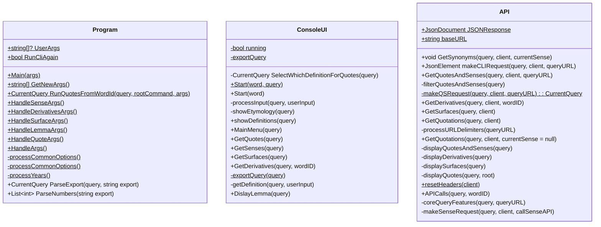

```mermaid
classDiagram
    class Program {
        +string[]? UserArgs$
        +bool RunCliAgain$
        +Main(args)$
        +string[] GetNewArgs()$
        +CurrentQuery RunQuotesFromWordId(query, rootCommand, args)$
        +HandleSenseArgs()$
        +HandleDerivativesArgs()$
        +HandleSurfaceArgs()$
        +HandleLemmaArgs()$
        +HandleQuoteArgs()$
        +HandleArgs()$
        -processCommonOptions()$
        -processCommonOptions()$
        -processYears()$
        +CurrentQuery ParseExport(query, string export)
        +List~int~ ParseNumbers(string export)
    }
	class ConsoleUI {
		-bool running$
		-CurrentQuery SelectWhichDefinitionForQuotes(query)
		+Start(word, query)$
		+Start(word)
		-processInput(query, userInput)
		-showEtymology(query)
		+showDefinitions(query)
		+MainMenu(query)
		+GetQuotes(query)
		+GetSenses(query)
		+GetSurfaces(query)
		+GetDerivatives(query, wordID)
		-exportQuery$
		-exportQuery(query)$
		-getDefinition(query, userInput)
		+DislayLemma(query)
	}
	class API {
		+JsonDocument JSONResponse$
		+string baseURL$
		+void GetSynonyms(query, client, currentSense)
		+JsonElement makeCLIRequest(query, client, queryURL)
		+GetQuotesAndSenses(query, client, queryURL)
		-filterQuotesAndSenses(query)
		-makeQSRequest(query, client, queryURL)$ : CurrentQuery
		+GetDerivatives(query, client, wordID)
		+GetSurfaces(query, client)
		+GetQuotations(query, client)
		-processURLDelimiters(queryURL)
		+GetQuotations(query, client, currentSense = null)
		-displayQuotesAndSenses(query)
		-displayDerivatives(query)
		-displaySurfaces(query)
		-displayQuotes(query, root)
		+resetHeaders(client)$
		+APICalls(query, wordID)
		-coreQueryFeatures(query, queryURL)
		-makeSenseRequest(query, client, callSenseAPI)
	}
```

#MyCodingProjectsOxford
8/11/2021